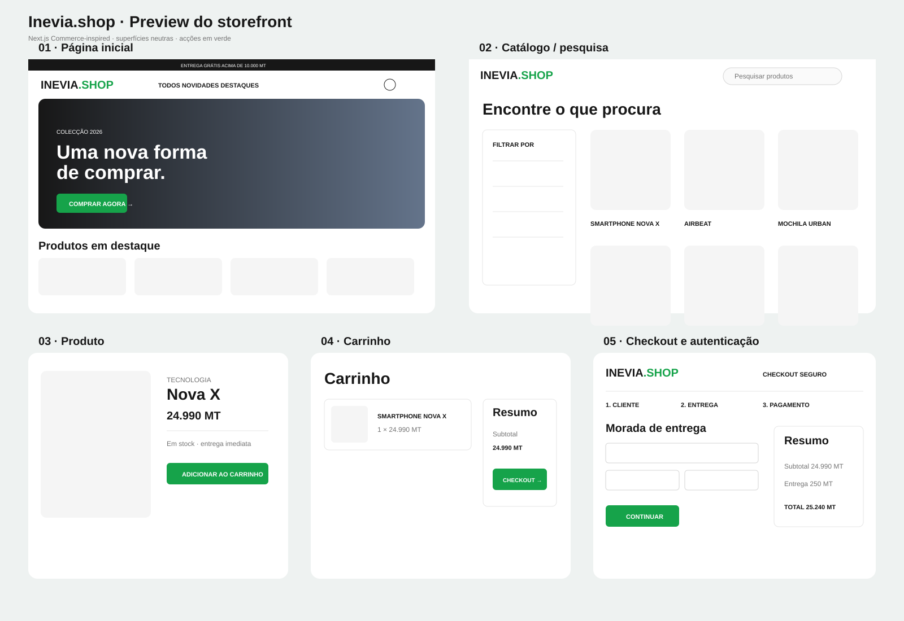
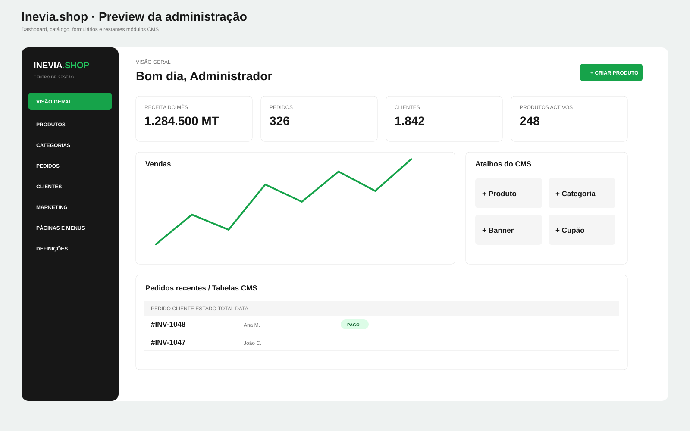

# Inevia.shop

Plataforma de e-commerce full-stack para Moçambique, construída com Next.js 16, React 19, TypeScript, Tailwind CSS 4, PostgreSQL e Prisma. Inclui storefront responsivo, checkout local, CMS em `/admin`, RBAC, catálogo, carrinho, pedidos e adaptadores de pagamento.

A interface segue a composição minimalista do storefront de referência, mantendo superfícies neutras, grelhas editoriais e navegação limpa; o verde Inevia é reservado para botões, foco e estados activos. Componentes interactivos acessíveis usam `@headlessui/react` e a iconografia consistente usa `@heroicons/react`.

## Preview do design

### Storefront, catálogo, produto, carrinho e checkout



### Dashboard e páginas do CMS



As pranchas permitem rever toda a linguagem visual directamente no GitHub. Consulte [`docs/previews`](docs/previews/README.md) para o mapa de páginas e as instruções de captura real no browser.

## Arquitectura

- `src/app/(store)`: páginas públicas renderizadas no servidor e optimizadas para SEO.
- `src/app/admin`: CMS e dashboard; o layout exige sessão e vínculo administrativo activo com a loja.
- `src/app/api`: Route Handlers validados com Zod.
- `src/lib`: acesso Prisma, sessão JWT em cookie HTTP-only e integrações server-only.
- `src/components`: UI reutilizável da loja, checkout e administração.
- `prisma`: schema relacional, migrations e dados de demonstração.

### Preparação multi-loja

A instalação começa com uma única loja (`inevia-shop`), pertencente ao administrador do seed. O domínio já isola dados comerciais por `Store`: produtos, categorias, marcas, carrinhos, pedidos, cupões, conteúdos, configurações, avaliações e favoritos têm `storeId`. Slugs, SKUs, números de pedido e códigos promocionais são únicos dentro da loja, e não globalmente. `StoreMembership` associa utilizadores a cada loja com uma função própria, permitindo que no futuro uma mesma conta administre marcas diferentes sem misturar dados.

`CURRENT_STORE_SLUG` escolhe a loja apresentada pelo storefront nesta fase. Todo novo acesso à base deve obter o identificador através de `getCurrentStore()` e incluir `storeId` no filtro. Quando for aberto o registo de novas marcas, esse resolver poderá passar a usar o domínio ou subdomínio do pedido sem alterar a camada de catálogo. Pedidos usam eliminação restrita para preservar o histórico mesmo que uma loja seja desactivada.

### Core preparado para PVD/POS futuro

O e-commerce continua a ser o produto principal. As estruturas de ponto de venda são opcionais: pedidos online funcionam sem localização, terminal, turno ou operador. Para uma futura aplicação `/pos`, o schema já contém localizações e armazéns (`Location`), terminais (`PosTerminal`), stock por localização (`InventoryLevel`), razão imutável de movimentos (`StockMovement`), turnos e movimentos de caixa (`CashSession` e `CashMovement`), pagamentos mistos, recibos e devoluções. `Order.channel` separa vendas `ONLINE`, `POS`, `ADMIN` e `MARKETPLACE` sem duplicar o motor de pedidos.

O seed cria somente a loja Inevia.shop e o seu armazém online; não activa terminais nem fluxos POS. `Product.stock` permanece como total compatível com o storefront nesta fase, enquanto `InventoryLevel` prepara a transição para stock por filial. Quando o POS for implementado, alterações de saldo deverão ocorrer numa transacção e gerar sempre um `StockMovement`; movimentos financeiros e documentos emitidos nunca devem ser apagados, apenas revertidos por novos registos.

### Catálogo ligado ao PostgreSQL

A home, pesquisa, listagem, página de produto e sitemap consultam agora o catálogo da loja actual através de Prisma. O CMS disponibiliza a listagem e criação em `/admin/produtos`; cada mutação valida a função do utilizador e inclui o `storeId` da sessão. A criação grava produto e saldo inicial do armazém na mesma transacção. Produtos removidos do catálogo são arquivados para preservar referências históricas.

### Carrinho persistente

O carrinho anónimo é identificado por cookies HTTP-only com validade de 30 dias. Preço, produto, variante, loja e disponibilidade são novamente verificados no servidor em cada adição; o browser envia somente identificadores e quantidade. A página `/carrinho` permite alterar quantidades, remover linhas e avançar para o checkout sem confiar em totais calculados pelo cliente.

Não existe dependência do BigCommerce, Shopify ou CMS externo. O padrão visual e de navegação é inspirado no Next.js Commerce, mas a persistência pertence integralmente à aplicação.

## Instalação local

Requer Node.js 20.9+ e PostgreSQL 15+.

```bash
npm install
cp .env.example .env
# edite DATABASE_URL, CURRENT_STORE_SLUG e gere AUTH_SECRET: openssl rand -base64 32
npm run db:migrate
npm run db:seed
npm run dev
```

Abra `http://localhost:3000`. O CMS fica em `http://localhost:3000/admin`. O seed cria `admin@inevia.shop`; a palavra-passe vem de `SEED_ADMIN_PASSWORD` e deve ser alterada antes de qualquer ambiente partilhado.

## Comandos

| Comando | Utilização |
|---|---|
| `npm run dev` | servidor de desenvolvimento |
| `npm run build` | geração Prisma e build de produção |
| `npm run lint` | ESLint |
| `npm run typecheck` | verificação TypeScript |
| `npm test` | testes unitários |
| `npm run db:migrate` | criar/aplicar migrations locais |
| `npm run db:deploy` | aplicar migrations em produção |
| `npm run db:seed` | criar admin, configurações e catálogo demo |

## Pagamentos e imagens

Os métodos activáveis estão em `StoreSettings.paymentMethods`. O adaptador M-Pesa mantém chaves e assinatura no servidor e segue a fronteira proposta pelo projecto `mpesa-connect`. Sem credenciais, devolve um erro seguro e não simula cobrança. Stripe/e-Mola podem implementar a mesma interface. Para uploads, configure S3 ou Cloudinary pelas variáveis documentadas; valide no servidor MIME (`image/jpeg`, `image/png`, `image/webp`, `image/avif`) e limite de 5 MB antes de persistir a URL.

## Produção

### Vercel

1. Importe o repositório e associe PostgreSQL gerido.
2. Configure todas as variáveis de `.env.example` necessárias.
3. Use `npm run build` como build command.
4. Execute `npm run db:deploy` numa etapa segura anterior ao deploy.

### Servidor próprio

Execute `npm ci && npm run build && npm run db:deploy`, depois `npm start` atrás de TLS e reverse proxy. Defina `NODE_ENV=production`, rode como utilizador sem privilégios e mantenha segredos num secret manager.

## Segurança

Passwords usam bcrypt (cost 12 no seed), sessões expiram em sete dias e são guardadas em cookies HTTP-only, `SameSite=Lax` e `Secure` em produção. Toda autorização administrativa é feita no servidor. Não envie chaves `MPESA_*`, `STRIPE_*`, `S3_*` ou `CLOUDINARY_*` para componentes cliente. Para produção, adicione rate limiting distribuído às rotas de login, recuperação, avaliações e pagamentos.
